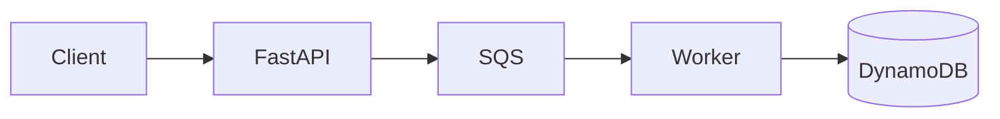
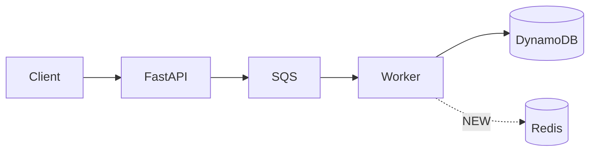

# Map Feature

A read-only, **reuse-first architecture gate**. Before building a feature, map what it actually
touches in the *real* code, find what already solves part or all of it, and show a
current→proposed architecture diff. End with a verdict and a saved note. **Write no feature code
until the user approves.**

The point is not the diagram — it's catching the failure mode where an agent builds something new
when it only needed to connect two things that already exist, or pulls in a dependency the project
already has. The diagram is how the user eyeballs whether the exploration was deep enough: a thin or
wrong current-state map is the tell that the code wasn't actually read.

## When to Use

- `/map-feature [feature description] [optional: explicit save path]`
- "Before we build X, map it" / "is there already something that does this?"
- Any time the next step would be building a non-trivial feature and reuse vs. net-new is unclear.

Skip it for trivial one-file changes — this is for work where over-building would cost real time.

## Hard Rules (read first)

These exist because the default behavior is shallow pattern-matching. Do not skip them.

1. **Read code, don't infer from names.** Every node in the current-state diagram must correspond
   to code you actually opened and traced. No guessing architecture from file or folder names.
2. **Phase 2 is mandatory.** Before proposing *any* new module/file/dependency, you must state what
   you grepped for and what you found. "I searched for `X` and found nothing" is a valid result;
   silently skipping the search is not.
3. **Bias hard toward reuse.** Connecting or extending existing pieces is the default. Net-new is
   the exception and must be justified with a concrete reason reuse can't work.
4. **Stop before building.** This skill produces a verdict and a note. It does not write feature
   code. Hand control back to the user for the go/no-go.

## Workflow

### Phase 0 — Scope
State, in one or two lines: what the feature is, and which subsystem(s) it plausibly touches.
If the feature is ambiguous or you can't tell where it lands, **ask** — don't guess your way into
mapping the wrong part of the codebase.

### Phase 1 — Map current state (from real code)
- Identify the entry points into the affected area (routes, handlers, commands, screens, jobs).
- Follow imports and call chains outward. Inventory the existing modules, services, and data flows
  that the feature will sit near.
- Render it as a Mermaid `graph LR` (or `TD`) diagram. Keep node labels to real component names
  from the code.



If you cannot populate this from code you actually read, say so and go read more before continuing.

### Phase 2 — Hunt for prior art  *(the step that earns this skill its keep)*
- **Grep** the codebase for existing implementations of the feature's concept (the verb/noun of the
  feature — e.g. "retry", "cache", "auth", "rate limit", "webhook").
- **Read the dependency manifest** — `package.json`, `requirements.txt` / `pyproject.toml`,
  `Package.swift`, `go.mod`, `Cargo.toml`, etc. — for a library already pulling that weight.
- Produce an explicit **"Already exists"** list:
  - what existing code/dependency solves part or all of the need, and
  - the *connection* the user would actually make instead of writing new code
    (e.g. "call `retry_policy` from `core/net.py` instead of adding a new retry loop").

If the search genuinely turns up nothing reusable, state that plainly — that's a real finding that
justifies net-new.

### Phase 3 — Propose post-feature state (reuse-biased)
Offer up to two options when both are real:
- **Minimal** — extend or connect what already exists. Fewest new nodes/edges. This is the default
  recommendation unless it genuinely doesn't work.
- **Net-new** — only when reuse can't cover it. Must include the specific reason why.

### Phase 4 — Diff + verdict
- Render the proposed state as a Mermaid diagram with **new nodes/edges marked**, e.g.:



- Call out:
  - **Unnecessary additions** the naive approach would have introduced.
  - **Duplicate dependencies** — anything you'd have added that the project already has.
- Give a clear recommendation (Minimal vs Net-new) with reasoning, then **stop**. Ask the user for
  the go-ahead.

## Saving the Note

After presenting the verdict, save the analysis as a Markdown note.

**Location resolution (in order):**
1. **Explicit path.** If the user gave a path/location (as an argument or in conversation), use it.
   No detection.
2. **Repo `docs/` folder.** Otherwise find the repo root: `git rev-parse --show-toplevel`.
   - If `<repo>/docs/` exists → save to `<repo>/docs/feature-maps/<feature-slug>.md`
     (the `feature-maps/` subfolder groups these and keeps real docs uncluttered; creating that one
     subfolder inside an existing `docs/` is fine).
   - If `<repo>/docs/` does **not** exist → **stop and ask** the user: create
     `docs/feature-maps/`, give a different path, or skip the note. **Never silently create a
     top-level `docs/` folder** (anti-bloat rule).
3. **Not in a git repo** (e.g. run from the vault or a loose folder) → same fallback: ask where to
   put it. Never guess.

**Note contents:**
- Frontmatter:
  ```yaml
  ---
  feature: <feature name>
  created: <YYYY-MM-DD>
  status: proposed
  verdict: <minimal | net-new>
  session: <id>
  session-project: <short-path>
  ---
  ```
  Populate `session` / `session-project` from `~/.claude/.current-session` per global rules
  (`SESSION_ID=$(grep ^SESSION_ID= ~/.claude/.current-session | cut -d= -f2-)` and the CWD line,
  short-path = CWD with `/Users/jarretttruett/Documents/` stripped).
- Body, in order:
  1. Scope
  2. Current-state Mermaid diagram
  3. "Already exists" findings
  4. Proposed-state Mermaid diagram (diff highlighted)
  5. Verdict + reasoning

Confirm the saved path to the user.
